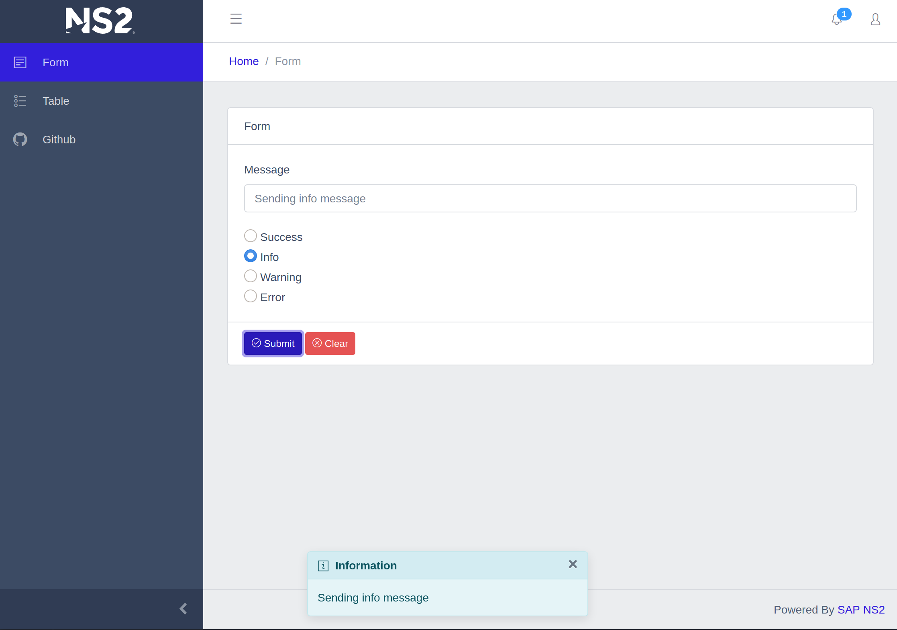

# demo-nginx-vue

**Work in Progress**

Sample project integrating bootstrap based coreui with [Vue](https://vuejs.org/). Initial scafold done with Vue CLI.



## Integration and Links

* [Vue cli](https://cli.vuejs.org/) used to generate this project
* [Style Guide](https://vuejs.org/v2/style-guide/) for Vue. Attempting to follow as best as possible
* [CoreUI Bootstrap](https://coreui.io) theme
* [Bootstrap-Vue](https://bootstrap-vue.org/) components
* [Vue Router](https://router.vuejs.org/) for view management
* [Vuex](https://vuex.vuejs.org/) for state management
* [vue-mobile-detection](https://github.com/ajerez/vue-mobile-detection) for checking mobile state
* [axios](https://github.com/axios/axios) as http client
* [jsonplaceholder](https://jsonplaceholder.typicode.com/) for sample table data

## Project setup
```
npm install
```

### Compiles and hot-reloads for development
```
npm run serve
```

### Compiles and minifies for production
```
npm run build
```

### Lints and fixes files
```
npm run lint
```

### Customize configuration
See [Configuration Reference](https://cli.vuejs.org/config/).
