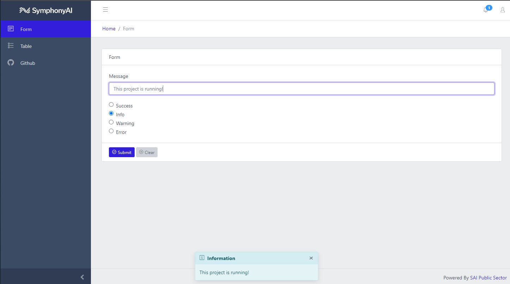

# demo-nginx-vue

Sample web application integrating bootstrap based coreui with [Vue](https://vuejs.org/). Initial scafold done with Vue CLI. The project can be deployed as a [docker](https://docs.docker.com/install/) container or pushed directly with a [buildpack](https://docs.cloudfoundry.org/buildpacks/nginx/index.html) to [Microsoft Azure](https://azure.microsoft.com/en-us/)



## Integration and Links

* [Vue cli](https://cli.vuejs.org/) used to generate this project
* [Style Guide](https://vuejs.org/v2/style-guide/) for Vue. Attempting to follow as best as possible
* [CoreUI Bootstrap](https://coreui.io) theme
* [Bootstrap-Vue](https://bootstrap-vue.org/) components
* [Vue Router](https://router.vuejs.org/) for view management
* [Vuex](https://vuex.vuejs.org/) for state management
* [vue-mobile-detection](https://github.com/ajerez/vue-mobile-detection) for checking mobile state
* [axios](https://github.com/axios/axios) as http client
* [jsonplaceholder](https://jsonplaceholder.typicode.com/) for sample table data

## Project setup

* Install a [nodejs](https://nodejs.org/en/download/) runtime is installed (LTS)

```
npm install
```

### Compiles and hot-reloads for development
```
npm run serve
```

### Compiles and minifies for production
```
npm run build
```

## Run as docker container

>You can create a public registry with security scanning for free at [Quay.io](https://quay.io)

* Build and push the image with this script. You will have to edit the quay.io registry endpoint for the push command to work
```bash
docker-build.sh
```

* Run the continer with this script
```bash
docker-run.sh
```

* The server will be running on [http://localhost:4200](http://localhost:4200)

## Deploy to Microsoft Azure

> TODO

### Docker

* Deploy a docker container with the following command

```bash
cf-push-docker.sh
```
